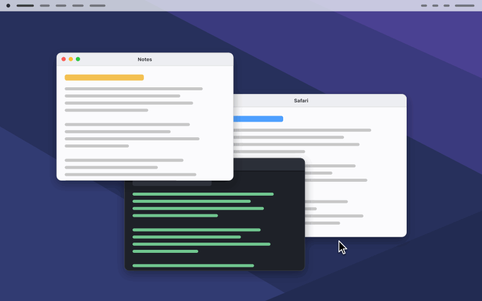
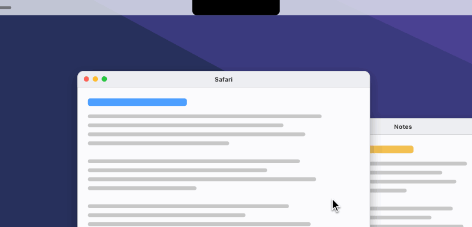
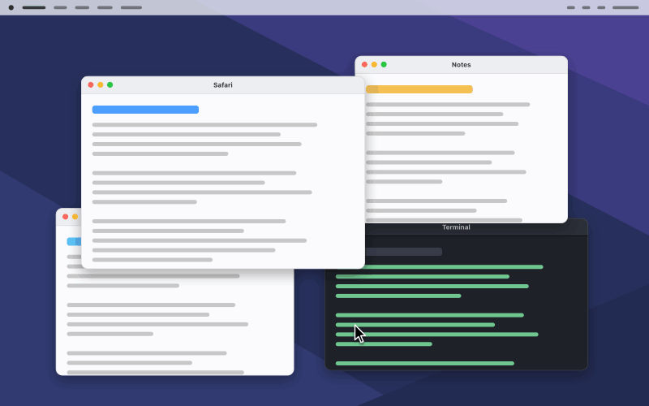
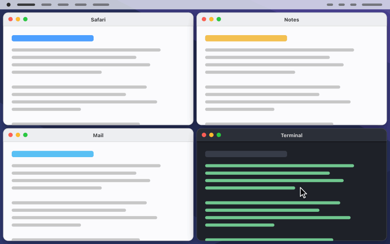
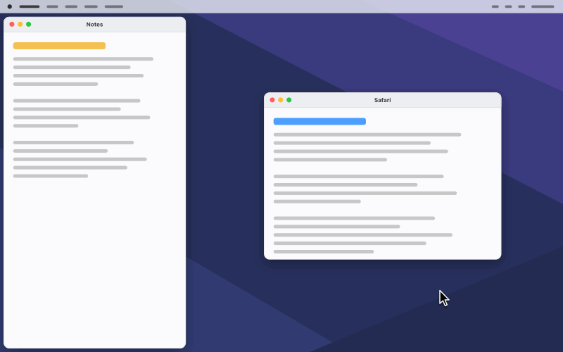
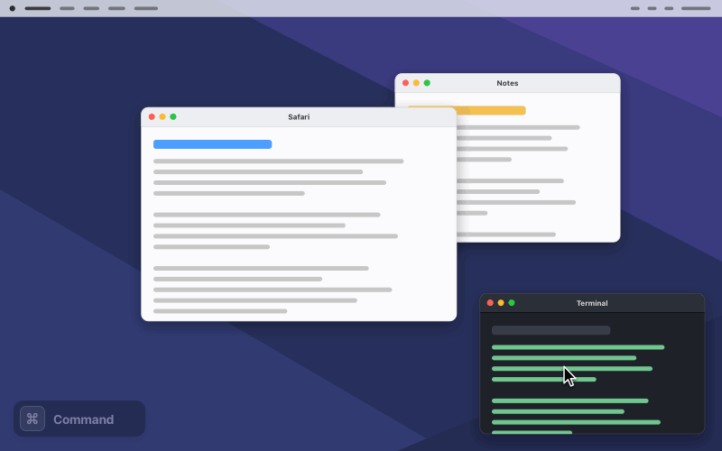

<p align="center">
  
</p>

<h1 align="center">SnappySnap</h1>

<p align="center">
  <strong>Drag to the edge. It is already snapped.</strong><br>
  A menu-bar app that gives macOS the window snapping Windows 11 has, and makes it look like it shipped with
  the Mac: halves, quarters and layouts from a snap bar that grows out of the notch, Snap Assist for the rest
  of the screen, and handles that resize two, three or four windows at once.
</p>

<p align="center">
  
  
  
  
  
  
</p>

## The problem

macOS tiles windows now, and it still gets in the way. You hold a window against the edge and wait for the
system to make up its mind. You get halves and quarters and not much else. And the one good idea it has,
dragging the edge two windows share, only works on windows macOS tiled itself, and only while they are aligned
to the pixel.

Windows 11 solved this years ago: a bar of layouts at the top of the screen, and an assistant that offers the
rest of the screen to your other windows. SnappySnap brings that to the Mac, drops the waiting, and draws all of
it the way macOS would have.

> The animations on this page are illustrations, drawn to the app's own measurements: the bands, the bar, the
> springs and the quarter-second snap are the real numbers. The windows are schematic.

## It snaps the instant you reach the edge

<p align="center">
  
</p>

This is the headline. There is no dwell on an edge: the zone lights up the moment the pointer is in it, and
the window is on its way the moment you let go.

- **A side is a half, a corner a quarter, the top the whole screen.** Each can be switched off on its own,
  the same choices macOS gives you for its own tiling.
- **You never have to reach the last pixel.** A zone arms 24 pt from the edge and survives 12 pt further out,
  so a hand that drifts back does not lose it and nothing flickers at the boundary.
- **The preview is a promise.** It morphs out of the window you are holding and shows the exact frame that
  window will take, gap included. It is drawn like macOS's own preview, in light and in dark mode.
- **Every move is animated.** A quarter of a second, ease-in-out, at your display's refresh rate, starting the
  moment you let go. No app is brought to the front on the way, so focus never changes.
- **Hold ⌥ Option to snap to halves from anywhere.** The two side bands grow until they meet in the middle of
  the display, so you do not have to travel to an edge at all. Off by default.
- **A gap, like macOS's margins.** Snapped windows sit 8 pt from the screen and from each other, and a window
  that outgrows the gap (zoomed, double-clicked, tiled by macOS) is brought back inside it half a second
  later, so one arrangement never has two kinds of edge in it.

## A snap bar that grows out of the notch

<p align="center">
  
</p>

Drag a window onto the camera housing and a black shape flows out of it on a spring, with the trackpad giving
one light tap as it arrives. Inside: **four layouts** (halves, two thirds and a third, a half beside two
stacked quarters, a 2 × 2 grid), each zone a drop target that previews on the desktop as you hover it.

- **It never flashes by accident.** The bar waits 125 ms before it grows, so dragging across the top of the
  screen to maximise a window does not summon it. The rest of the top edge still fills the screen.
- **On a display with no notch it draws an island.** A black capsule appears under the top edge for the length
  of the drag, shaped and animated like the island a notch app draws there, and the bar grows out of that.
  Prefer something plainer? Settings offers a floating Liquid Glass bar instead, or the notch where there is
  one and the floating bar elsewhere.
- **The pair cell places two windows in one drop.** When another window is open, the bar opens with an extra
  first cell showing two app icons: the window you are dragging on the left, the one you used last on the
  right. Drop anywhere in it and both land side by side.
- **The layouts are yours to edit**: a plain JSON file, `Sources/SnappySnap/Resources/Layouts.json`.

## Snap Assist offers the rest of the screen

<p align="center">
  
</p>

Drop a window into a layout from the bar and you have told SnappySnap what arrangement you want. It offers
**every other space of that layout at once**, each with a card for every other window: app icon and title, on
Liquid Glass. Click a card and that window flies into that space.

- **The windows in the way are dealt into a deck**, staggered in a corner of the display like the edge of a
  pack of cards, and dealt back when you are done. Nothing is hidden or minimised.
- **Nothing is ever lost.** Every window is written down *before* it moves, so a crash in the middle cannot
  strand one: the next launch puts them all home.
- **⎋ Escape, a click elsewhere or a new drag ends it**, and ending never undoes what you already placed.
- **No Screen Recording.** That is why the cards show an icon and a title, not a live thumbnail.

## Handles macOS does not have

<p align="center">
  
</p>

Between any two adjacent windows a small pill appears, with a resize pointer, and moves the edge they share.
Where windows meet at a corner, a round **knob** moves the whole junction, in two directions at once.

- **It does not care who placed the windows.** Snapped by SnappySnap, tiled by macOS or lined up by hand: two
  windows whose facing edges are within 16 pt and overlap by 60 pt get a handle. They do not have to be
  aligned to the pixel, or even be the same height.
- **Horizontal edges too.** Stacked windows get a handle on the line between them.
- **One knob for three or four windows.** At the centre of a 2 × 2, at a T, at an L, where two windows touch
  corner to corner, and at each end of every divider, the screen edge included.
- **Smooth, because nothing is resized while you drag.** What follows your pointer is a picture: one preview
  per window over a dimmed screen. The windows take their frames when you let go, the shrinking ones first.
  Resizing another app's window live means waiting for that app on every frame; a preview never waits.
- **It stops where the window stops.** Each window has a smallest size; the handle and the previews simply
  stop there while your pointer carries on, and pick up again when it comes back.
- **Hold ⌘ Command and they step aside**, at once, so you can grab a window's own edge and resize it alone.

## It knows how much room a window needs

<p align="center">
  
</p>

A snap is not a slot in a grid. Every drop is solved as an arrangement: the windows involved, the space they
share and the limits each one has.

- **A drop takes what is actually free.** Drop a window beside one that holds the left third and it takes the
  other two thirds, not a half with a hole or an overlap next to it.
- **A window that needs more room gets it from its neighbour.** If an app will not shrink to its share, the
  divider moves and the window beside it gives way, down to its own minimum. You see both frames in the
  preview before you let go.
- **Never an overlap.** What cannot fit on the display at all hangs past its right or bottom edge rather than
  over another window.
- **It learns each app's smallest size once.** macOS publishes no minimum window size, so SnappySnap ships with
  measured sizes for the system's apps and a few common ones, measures any other app the first time you use a
  handle beside it (one blink of that window, once), and lowers a size by itself whenever it sees a smaller
  window. The list is in Settings › Handles, where you can edit it, reset it or switch the measuring off.

## Your own layouts, under ⌘ Command

<p align="center">
  
</p>

Hold **⌘ Command** while dragging and the edges, the corners and the bar all stand down. What appears instead
is your own set of areas, all at once, the one under the pointer more opaque than the rest. Let go and the
window lands exactly there.

You write the areas as JSON in Settings › Custom Areas, comments allowed, with a **Verify** button that names
the exact key that is wrong. Each area can be written **per screen name, per resolution, for the built-in
display, or once for every display**, as an explicit rectangle or as an anchor with a size in points or in
percent. This is the configuration the app starts with, one almost-maximised area that is sized differently on
each kind of screen:

```jsonc
[
  {
    // Almost maximized window
    "screenName:built-in":        { "anchor": "center", "size": { "widthPercent": 0.9, "heightPercent": 0.9 } },
    "screenResolution:2560x1440": { "anchor": "center", "size": { "width": 1728, "height": 1080 } },
    "screenResolution:1920x1080": { "anchor": "center", "size": { "width": 1440, "height": 900 } },
    "*":                          { "anchor": "center", "size": { "widthPercent": 0.8, "heightPercent": 0.8 } }
  }
]
```

Areas may overlap; the first one in the list that holds the pointer wins. A `null` takes an area off one
display and leaves it on the others. The page lists the displays attached right now with the exact name
to write for each, so it is copied rather than guessed. ⌘ Command never falls back to the ordinary zones: with
no area under the pointer, it places nothing.

## It gets out of the way when it should

- **It has no window of its own.** It lives in the menu bar, and the icon can be hidden; opening the app again
  brings Settings back.
- **It never takes focus.** Nothing SnappySnap does activates an app or changes which window is in front,
  except the window you pick in Snap Assist.
- **Switch Space or open Mission Control and everything comes down**, in one 120 ms fade, with every parked
  window sent home first. A drag you keep holding through a Space change carries on and snaps on the new Space.
- **Your windows stay on your Mac.** Accessibility is the only permission SnappySnap needs to work, and there
  is no Screen Recording. The app uses the network for one thing, its own update.
- **It keeps itself up to date.** It looks for a newer version when it starts and once a week, and tells you
  with a notification. Click **Update**, there or in Settings › General, and a small window fetches it;
  **Install and Relaunch** then swaps the app and reopens it. Nothing is fetched or installed without a click.
- **Quitting puts everything back.** Whatever Snap Assist has parked goes home on the way out.
- **English and French**, following the language your Mac is set to.

## Requirements

- **macOS 26 or later.** Built and measured on macOS 27.
- **The Accessibility permission, and nothing else.** It is how an app is allowed to see which window you are
  dragging and to move and resize windows. An onboarding window explains it, links straight to the pane, and
  the app starts the moment the grant arrives, with no relaunch.
- **macOS's own edge tiling turned off.** In Desktop & Dock, turn off “Drag windows to screen edges to tile” and
  “Drag windows to menu bar to fill screen”. The two systems answer the same drags. SnappySnap warns once at
  launch and shows the live state in Settings › System.

## Install

Download the disk image from [the latest release](https://github.com/bambidotexe/snappy-snap/releases/latest),
open it and drag **SnappySnap** to Applications, then open it once and grant Accessibility when it asks. It is
signed with a Developer ID and notarized by Apple, so it opens without a warning.

SnappySnap keeps itself up to date from there: it looks for a newer release when it starts and once a week,
and tells you with a notification. Click **Update**, and a window fetches it and checks it while the app runs;
**Install and Relaunch** then swaps the app, reopens it and says how it went. Nothing is fetched or installed
without a click.

From this repository instead. It is a SwiftPM package with no Xcode project:

```sh
Scripts/install.sh                # production build → /Applications/SnappySnap.app, launched
Scripts/publish.sh <level>         # the same, plus a version bump (patch/minor/major) and the disk image on a GitHub release
Scripts/run.sh                    # a familiar name for Scripts/install.sh
swift test                        # the two library suites; count two summary lines
```

Run it again to update: it quits the running copy, replaces the installed one and reopens it. The app always
runs from `/Applications`. Settings › General › Uninstall takes it off again, with everything it set up
outside its own folder.

**About signing.** The Accessibility grant is tied to the code signature, and an ad-hoc signature changes on
every build, which resets the grant each time. `Scripts/signing.env` holds the identity: it looks a Developer
ID Application certificate for the Wooflab team up in the keychain by team id, so a rebuild keeps the same
signature and the grant survives. `SIGN_IDENTITY` in the environment overrides it for a different certificate:

```sh
SIGN_IDENTITY="Apple Development: Your Name (TEAMID)"
```

`Scripts/release.sh` is the shippable build: it signs with the Developer ID identity, notarizes and staples
the app and the disk image, and checks Gatekeeper accepts both.

## Settings

Open them from the menu-bar item (⌘,), or open SnappySnap again from Applications or Spotlight, which is the
way in when the icon is hidden. Seven pages; every change applies as you make it. General also holds the
update check and a **Quit SnappySnap** button, which is there whether or not the icon is, and **Tip** is
where you can offer a coffee.

<details>
<summary><strong>Every setting, with its default</strong></summary>

<br>

| Page | Group | Setting | Default |
|---|---|---|---|
| General | Startup | Launch at login | off |
| General | Startup | Show in menu bar | on |
| Snapping | Edges and corners | Drag to the left or right edge for a half | on |
| Snapping | Edges and corners | Drag to the top edge to fill the screen | on |
| Snapping | Edges and corners | Drag to a corner for a quarter | on |
| Snapping | ⌥ Option key | Hold ⌥ Option to snap to halves from anywhere | off |
| Snapping | Unsnapping | Restore a window's size when you drag it away | off |
| Snapping | Gap | Leave a gap around snapped windows | on |
| Snapping | Gap | Keep every window inside the gap | on |
| Snap Bar | Snap bar | Show the snap bar when dragging to the top | on |
| Snap Bar | Snap bar | Haptic feedback when it appears | on |
| Snap Bar | Style | Notch or island · Floating bar · Notch or floating bar | Notch or island |
| Snap Bar | Snap Assist | Suggest windows for the remaining spaces | on |
| Snap Bar | Snap Assist | Animation: Smooth · Balanced · Battery | Balanced |
| Handles | Handles | Show handles between windows | on |
| Handles | Smallest window sizes | Measure an app the first time you use a handle next to it | on |
| Handles | Apps | The list of window sizes, one row per app, with Add…, Remove and Reset | the built-in list |
| Custom Areas | Custom areas | Hold ⌘ Command while dragging to use your own areas | on |
| System | Compatibility | Use hidden macOS features | on |

*Animation* paces the Snap Assist deck only: Smooth aims at your display's refresh rate, Balanced at 60,
Battery at 30. Snaps and handle releases always run at the display's own rate.

*Use hidden macOS features* relies on parts of macOS that Apple does not document. On, you get four things:
exact window matching, a resize pointer over the handles, a snap bar drawn above other notch apps, and the blur
behind it. Off, every feature still works, a little less exactly and with no pointer over the handles. A macOS
update can break these parts. The app still opens without them, and Settings › System says which of the four
your macOS offers. The full list is `docs/private-api-index.md`.

There is no pause switch: if you do not want SnappySnap snapping, quit it, from the menu bar or from the
button at the bottom of Settings › General.

</details>

## Known limits

- **No keyboard shortcuts.** Snapping is a drag.
- **No Snap Groups**, no Dock or App Switcher integration, no layout flyout on the green button, and no
  graphical layout editor: layouts and custom areas are JSON.
- **Several windows of one app land one after the other.** An app moves its own windows one at a time, so a
  cross of four Safari windows settles in visible steps. Different apps move together.
- **One blink the first time** a handle is used beside an app that has never been measured.
- **A window whose minimum has never been measured can land larger than its preview showed**; the arrangement
  settles a beat later, and from then on preview and landing agree.
- **With several displays**, edges, zones, the preview and the deck are tested. The snap bar and the pair cell
  are written for it and not yet tested there. Nothing SnappySnap draws spans two displays.
- **Not on the App Store.** An App Store app is not allowed to move other apps' windows.

The full list, with the reason behind each, is `docs/functional.md` § 20.

## How it works

A listen-only event tap follows the drag, and Accessibility names the window under the pointer and moves and
resizes it. Geometry, zones, the arrangement solver and every animation curve live in `SnapCore`, a pure
library with no AppKit in it, covered by 608 unit tests. Every animated window write goes through
one writer with a serial queue per app and a single-slot mailbox per window, off the main thread, which
is what keeps a drag at the display's refresh rate. Mission Control and Space changes are not announced by
macOS in time to be useful, so both are caught by watching: the first by its full-screen backdrop appearing in
the window list, the second by two one-pixel sentinel panels that slide away with the Space. See
`docs/architecture.md` and `docs/macOS.md`.

## Documentation

- `CLAUDE.md`: the operating manual for an agent, with what the app is, the workflow for a change, where a change lands, rules and traps (start here)
- `docs/README.md`: the index, with which document answers which question and how to start
- `docs/functional.md`: every functional rule, by feature, with the numbers. The authority
- `docs/architecture.md`: the three targets, what each layer owns, the path from a drag to a zone to a window write, threading
- `docs/macOS.md`: the platform facts the app relies on
- `docs/pitfalls.md`: what looks right on macOS and is not, with the measurements
- `docs/manual-test-checklist.md`: the app target's only verification
- `docs/private-api-index.md`: the hidden macOS features, what each buys, and how the app works without it

## Support

SnappySnap is free and carries no ads. If it saves you trouble, you can leave a tip on
[Ko-fi](https://ko-fi.com/bambidotexe).

## Notes

- Personal build: English and French, no licensing.
- `swift test` runs 726 tests across the two library targets (608 + 118); the app target has none, and
  `docs/manual-test-checklist.md` is its verification.
- Any other window manager that answers the same drags will fight it; run one at a time.
